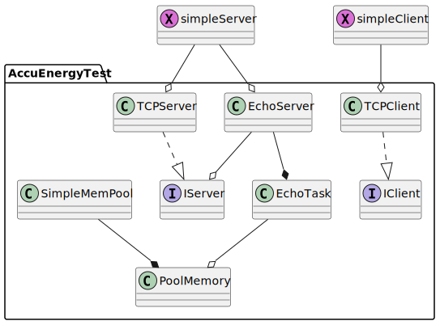
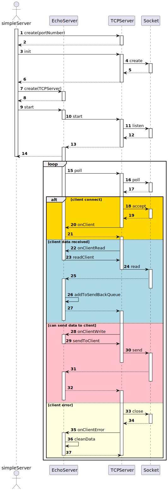

[](https://github.com/pingkai/ccuenergyTest/actions/workflows/Linux.yml)

This is a small C++ project implicating a TCP server and client to EchoBack the message from the client,
the server supports multiple clients.

Because the epoll() APIs are not available on macOS, this project uses the poll() API handling all the clients
in a signal thread, and the clients don't block each other.

You can find the usage of the server api in [here](src/IServer.h), the project support Clang but not gcc, and the AddressSanitizer
is enabled by default, you can change it in [CMakeLists.txt](CMakeLists.txt).

Now the code coverage of the testing is about 78%.

## How to build
The project don't depend on any other libraries. You should have a clang which support C++11 and CMake to build it.
you can refer to [Linux CI file](.github/workflows/Linux.yml). And it's also available on macOS.


## How to use

```shell
mkdir build
cd build
cmake ../
make -j8
./simpleServer # start a server, you can input q to quite, the server port is 8081

# use another terminal

./simpleClient "127.0.0.1" 8081 # you can start the client from anther device, then you should change the ip address


```


## TODO:

1. ipv6 supporting
2. more unit tests

## reference:

1. https://www.ibm.com/docs/en/i/7.1?topic=designs-using-poll-instead-select
2. https://stackoverflow.com/questions/2597608/c-socket-connection-timeout

## UML

### Class



<!--

```
@startuml Class
'https://plantuml.com/class-diagram

namespace AccuEnergyTest {
interface IServer
interface IClient

IServer <|.up. TCPServer
IClient <|.up. TCPClient

EchoServer --o IServer
EchoServer --* EchoTask

SimpleMemPool --*PoolMemory

EchoTask --o PoolMemory
}

simpleServer --o EchoServer
simpleServer --o TCPServer
simpleClient --o TCPClient
simpleServer << (X,orchid)>>
simpleClient << (X,orchid)>>

@enduml
```
-->

### Sequence of the server


